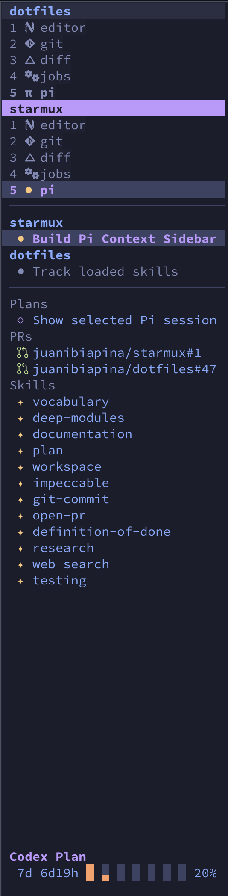

# Starmux

A fast and configurable sidebar for tmux.

- View tmux sessions and windows, host CPU, memory, and battery status, live Pi sessions and selected Pi context from [pi-workbench](https://github.com/juanibiapina/pi-workbench), and AI provider usage
- Navigate with a mouse and configure click actions for any sidebar row
- Supports colorschemes



The screenshot uses my [custom Starmux configuration](https://github.com/juanibiapina/dotfiles/blob/main/dotfiles/tmux/.config/starmux.toml).

See [slim sidebar configuration](docs/configuration.md#slim-sidebar) for the two-column layout and [palettes](docs/configuration.md#palettes) for colorschemes.

## Requirements

- A build of [tmux PR #5468: Add a vertical (side) status line](https://github.com/tmux/tmux/pull/5468).

## Installation

Install Starmux:

```sh
brew install juanibiapina/taps/starmux
```

Generate the tmux adapter (may also be required after upgrades).

```sh
mkdir -p "$HOME/.config/tmux"
starmux init tmux > "$HOME/.config/tmux/starmux.conf"
```

Choose the sidebar geometry and outer style in `.tmux.conf`, then load the adapter:

```tmux
set -g side-status left
set -g side-status-width 31
set -g side-status-style default
source-file ~/.config/tmux/starmux.conf
```
